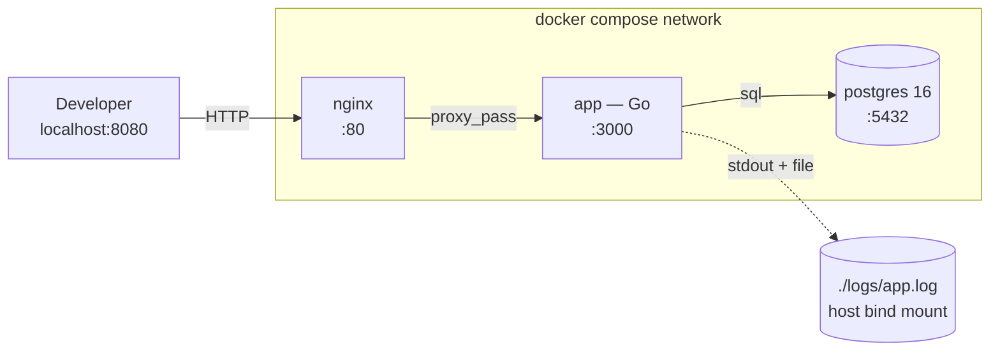
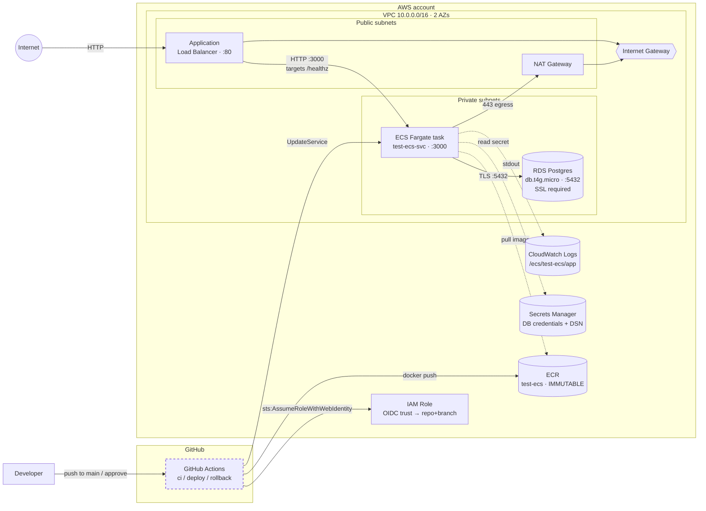

# Jobs API — Dockerized Go service deployed to AWS ECS

A small Go HTTP API (jobs CRD + healthchecks) used to exercise a full
container lifecycle: local development with `docker compose`, infrastructure
as code with Terraform, and an OIDC-authenticated GitHub Actions pipeline
that builds, pushes, and deploys to AWS ECS Fargate.

> Deeper docs live alongside the code:
> - `terraform/README.md` — IaC layout, apply order, tear-down.

---

## Architecture

> **The code in the two fenced blocks below is Mermaid diagram code — it is
> not pseudocode and it is not meant to be read as text. Run it through
> [https://mermaid.live](https://mermaid.live) to render the diagrams:**
> copy everything between the ` ```mermaid ` and ` ``` ` fences, paste it
> into the left-hand editor pane on mermaid.live, and the rendered diagram
> appears on the right.
>
> GitHub also renders Mermaid natively when this README is viewed in the
> browser, so on github.com the blocks appear as diagrams automatically —
> no copy/paste needed there.

### Local stack (`docker compose`)



### Deployed stack (AWS · `us-east-1`)



**How to read it.** Solid arrows are runtime data flow; dotted arrows are
control / metadata flow (image pulls, log writes, secret reads). The dashed
`Actions` border denotes the manual approval gate — no edge from GitHub
reaches AWS without a reviewer's click on the `production` environment.

**Key invariants the diagram encodes:**

- **No public-internet path to ECS or RDS.** ECS sits in a private subnet
  reachable only via the ALB; RDS is only reachable from the ECS task
  security group. Egress for ECS (ECR pulls, Secrets Manager reads,
  CloudWatch writes) goes via NAT.
- **No long-lived AWS credentials in GitHub.** The `Actions → IAMRole`
  arrow is OIDC: GitHub mints a short-lived JWT, AWS STS verifies it
  against the trust policy, hands back temporary credentials.
- **Image immutability.** Every deploy targets `<ecr>:<commit-sha>`. The
  same SHA can never be silently overwritten because ECR is configured
  `IMMUTABLE`.

Endpoints exposed by the app:

| Method + path | Purpose |
|---|---|
| `GET /` | Service banner: `{"service":"test-ecs"}` |
| `GET /healthz` | Liveness — always 200 if the HTTP server is up. Used by ALB / Docker healthcheck. |
| `GET /readyz` | Readiness — pings the DB with a 2s timeout, 503 if unreachable. |
| `GET /api/jobs` | List jobs |
| `POST /api/jobs` | Create job |
| `GET /api/jobs/{id}` | Read job |
| `DELETE /api/jobs/{id}` | Delete job |

---

## Run locally with `docker compose`

Prerequisites: Docker + Docker Compose. `curl` for smoke tests; Postman
optional (collection in `postman/`).

```bash
cp .env-sample .env          # local-dev defaults; edit if needed
docker compose up --build -d # app + Postgres + nginx
docker compose ps            # all three should be 'Up' / 'healthy'
```

The stack listens on `${NGINX_HOST_PORT}` (default `8080`):

```bash
curl http://localhost:8080/                # {"service":"test-ecs"}
curl http://localhost:8080/healthz         # {"status":"ok"}
curl http://localhost:8080/api/jobs        # []

# Create + delete
JOB=$(curl -s -X POST http://localhost:8080/api/jobs \
  -H "Content-Type: application/json" \
  -d '{"title":"Backend Engineer","company":"Acme","status":"open"}')
ID=$(echo "$JOB" | jq -r .id)
curl -i -X DELETE "http://localhost:8080/api/jobs/$ID"   # 204
```

Logs go to **stdout** (CloudWatch-ready) *and* `./logs/app.log` (host
bind mount for `tail -f`). Migrations run on app boot via
`migrate.RunUp` in `cmd/server/main.go`.

Tear down:

```bash
docker compose down       # stop, keep DB volume
docker compose down -v    # also drop pgdata (full reset)
```

---

## CI/CD pipeline

Three workflows under `.github/workflows/`. Authentication to AWS is **OIDC
only** — no static keys in repo secrets. The IAM role's trust policy is
scoped to this repo + branch.

### `ci.yml` — runs on every PR to `main`

The merge gate. Does not push images or touch AWS.

| Step | What it does |
|---|---|
| `gofmt -l` | Fails if any file isn't formatted. |
| `go vet ./...` | Static analysis. |
| `go test -race -count=1 ./...` | Tests with the race detector; `-count=1` defeats Go's test cache. |
| Docker build (no push) | Catches Dockerfile regressions before merge. Uses BuildKit + GHA cache. |

### `deploy.yml` — runs on push to `main` (or manual dispatch)

The release pipeline. Three sequential jobs:

| Job | What it does |
|---|---|
| `lint-and-test` | Same checks as CI, repeated as defense in depth in case branch protection were ever misconfigured. |
| `build-and-push` | OIDC → ECR login → builds the Docker image → tags as `<ecr>:${{ github.sha }}` (ECR is `IMMUTABLE`, so tags can never be silently overwritten) → pushes. Outputs the URI for the next job. |
| `deploy` | **Paused at the `production` environment gate** — required reviewers must approve. Once approved: pulls the current ECS task definition, swaps the `image:` to the new SHA, registers a new revision, calls `aws ecs deploy-task-definition`, waits for the service to stabilise, then smoke-tests `/healthz` from the runner. |

### `rollback.yml` — manual trigger only

Recovery path for a bad deploy. Two modes:

- **No input** → redeploys the *previous* task-definition revision. The 90% case.
- **`image_tag` provided** → deploys a specific commit SHA from ECR (when the bad version is several revisions back).

Same `production` environment gate as deploy. Refuses to roll back to the
bootstrap placeholder image. Smoke-tests after the roll.

---

## Repository layout

```
.
├── cmd/
│   ├── server/             # HTTP server entrypoint
│   └── migrate/            # one-shot migration tool
├── internal/
│   ├── config/             # 12-factor env-var config
│   ├── db/                 # pgx pool + ping
│   ├── handlers/           # /api/jobs + /healthz + /readyz
│   ├── logging/            # slog → stdout (+ optional file)
│   ├── migrate/            # boot-time migration runner
│   └── models/
├── migrations/             # SQL up/down migrations
├── nginx/templates/        # local-only reverse proxy config
├── postman/                # API smoke-test collection
├── docker-compose.yml      # app + db + nginx
├── Dockerfile              # multi-stage, non-root
├── .github/workflows/      # ci, deploy, rollback
├── terraform/
│   ├── bootstrap/          # state bucket, lock table, ECR (one-time)
│   └── main/               # VPC, ECS, ALB, RDS, IAM, Secrets Manager
└── README.md               # this file
```

---

## Assumptions

The notable ones.

**App / container**
- **Developers may need to `exec` into the running container.** The final
  image stays on `alpine:3.20` rather than distroless, so `docker compose
  exec app sh` and `apk` ad-hoc debugging keep working. Trade-off:
  slightly larger image and wider CVE surface than distroless.
- **Health checks live in the app, not in nginx.** `nginx` only proxies.
  `/healthz` is liveness (no dependencies); `/readyz` pings the DB with a
  2s timeout. The compose `app` service uses `/healthz` for its container
  healthcheck; `nginx` waits on `condition: service_healthy` so it never
  serves traffic before the app is listening.
- **ECS uses `/healthz` on the ALB target group, not `/readyz`.** Using
  `/readyz` would couple deregistration to transient DB blips. `/readyz`
  is reserved for human/manual probing.
- **The committed `migrate` binary is intentional.** Local tooling per the
  `go run ./cmd/migrate -direction up|down` workflow. Excluded from the
  Docker build context via `.dockerignore` so it doesn't bloat layers.
- **No secrets are baked into the image or compose file.** All sensitive
  or environment-specific values come from `.env` (gitignored, seeded
  from `.env-sample`). Compose uses `${VAR:?...}` to fail fast if a
  required variable is missing. In AWS, secrets come from Secrets Manager
  via the task definition's `secrets:` block.

**Infrastructure**
- **RDS is set for tear-down convenience**: `multi_az = false`,
  `deletion_protection = false`, `skip_final_snapshot = true`. Each of
  these flips for prod (multi-AZ for HA, deletion protection on, snapshot
  on destroy).
- **The GitHub OIDC provider must already exist in the AWS account.**
  AWS allows only one OIDC provider per URL per account. The Terraform
  uses a `data` lookup to reference the existing provider rather than
  creating one, so a target account that has never used GitHub Actions
  with AWS needs the provider bootstrapped once via
  `aws iam create-open-id-connect-provider`.

---

## What I'd improve with more time

The largest items.

**App / container**
- **Move to a distroless final stage.** `gcr.io/distroless/static-debian12:nonroot`
  cuts the image from ~25 MB to ~5 MB, runs non-root by default, and
  removes the shell + apk attack surface. Cost: no `docker exec sh` for
  debugging — mitigated with the `:debug-nonroot` tag during incidents,
  or by adding a `healthcheck` subcommand to the Go binary so the
  Dockerfile `HEALTHCHECK` doesn't need a shell.
- **Pin base images by digest.** `golang:1.25-alpine@sha256:...` and
  `alpine:3.20@sha256:...` make builds reproducible and protect against
  tag mutation. Pair with Dependabot/Renovate to keep digests fresh.
- **Tighten the nginx config.** Today it's a vanilla reverse proxy. Prod
  would want `proxy_set_header` for `Host`, `X-Real-IP`,
  `X-Forwarded-For`, `X-Forwarded-Proto`; explicit timeouts; gzip; and a
  deny rule for `/healthz` from outside the VPC so ALB checks bypass
  logging noise.
- **Run migrations as a separate step, not on app boot.** Today
  `cmd/server/main.go` calls `migrate.RunUp` before serving. Convenient
  locally but risky in ECS — every task replica races the same migration
  on rollout. Better: a one-shot ECS task (or CI step) that runs
  migrations, gated before the service deploy.
- **Graceful pool shutdown ordering.** Today `pool.Close()` is deferred
  before `srv.Shutdown` returns. The explicit ordering should be: stop
  accepting → drain in-flight requests → close the pool.

**Infrastructure / IaC**
- **Restore tear-down protections for production.** This repo relaxed
  several safety flags so `terraform destroy` works in one command;
  flip them back for a real environment:
  - Drop `force_destroy = true` on the S3 state bucket so versioning
    actually protects state from accidental deletion.
  - Drop `force_delete = true` on the ECR repo so it refuses to delete
    while images exist.
  - Set `skip_final_snapshot = false` (with a `final_snapshot_identifier`)
    and `deletion_protection = true` on `aws_db_instance.main`.
  - Add an `aws_s3_bucket_lifecycle_configuration` to expire non-current
    state versions after N days so the bucket doesn't grow unbounded.
